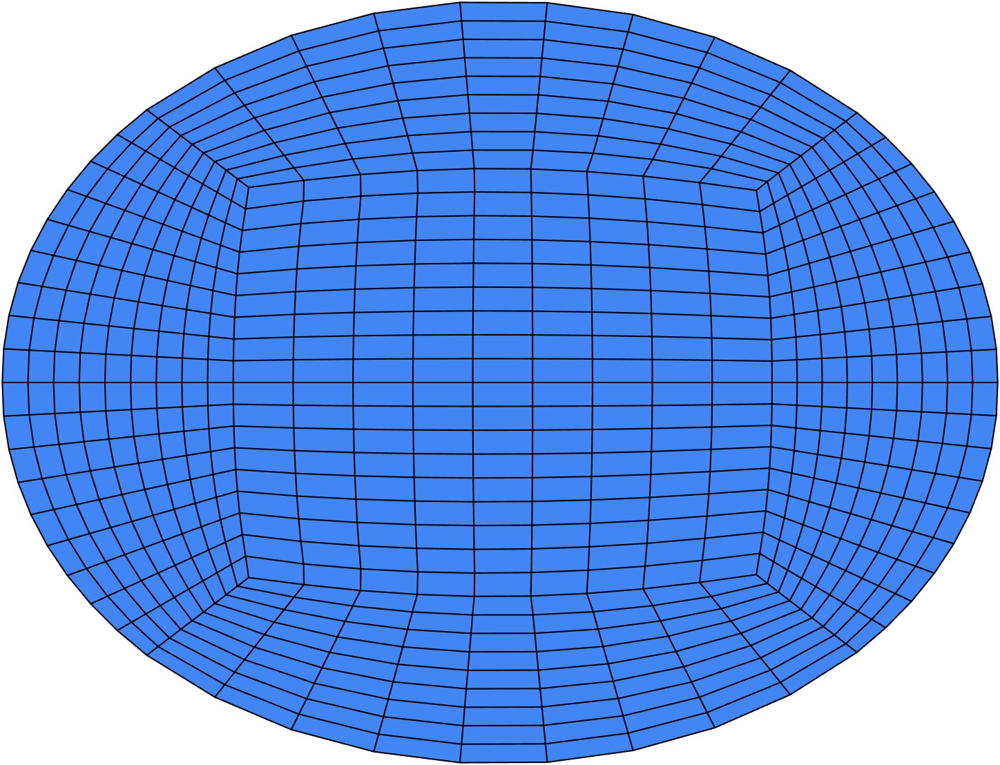
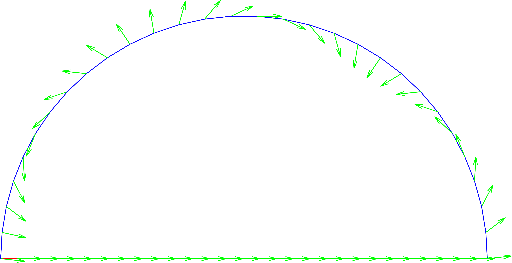
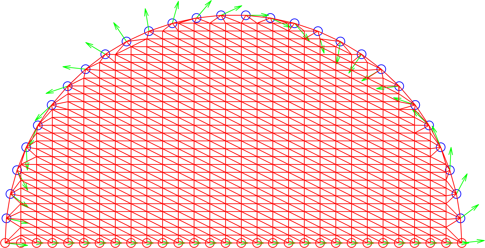
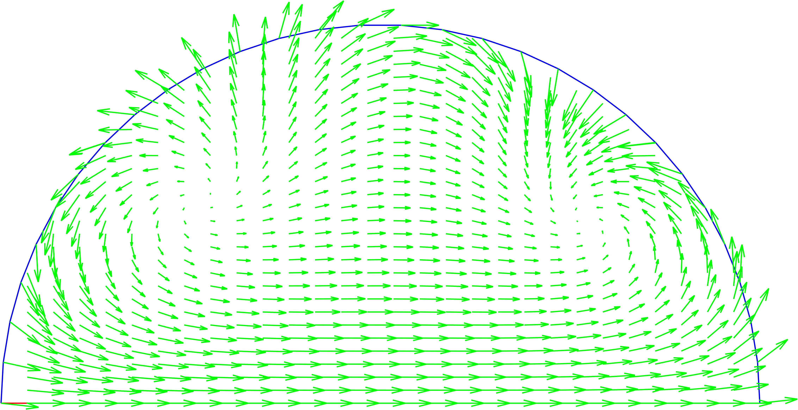
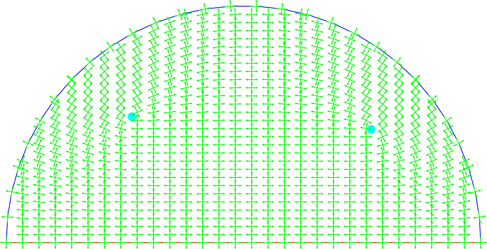
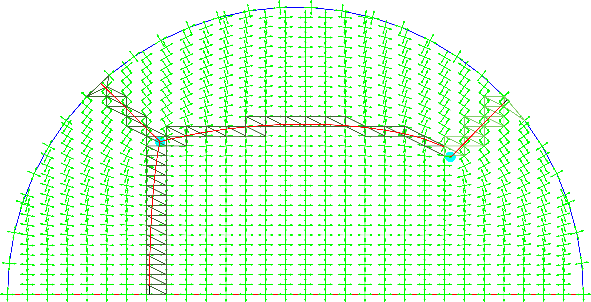
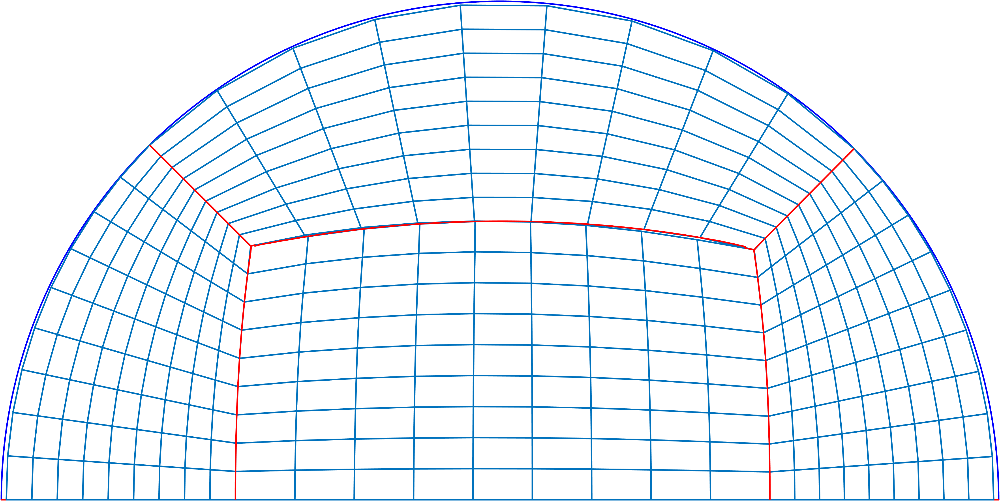

# Disc quadrilateral mesh
Implementation of the algorithm propused in "A PDE based approach to multi-domain
partitioning and quadrilateral meshing" (see [here](https://www.ljll.math.upmc.fr/~frey/publications/imr21.pdf)). Although the implementation is general
it has only been tested on a semicircle. The inputs are the radius of the circle, the center and the number of subdivisions of the centre square.

# Result
The following is the main result of the implementation. The resulting mesh can be used for any purpose. 

# Pedagogical value
I think the main contribution of the project is its pedagogical value. Through the code you can inspect all the main parts of the complex algorithm.
These parts are shown below. 
## 1. Creation of the boundary vector field

## 2. Mesh grid and delaunay triangulation

## 3. FEM solution

## 4. Find the singular points and the cross field

## 5. Find the streamlines by advection

## 6. The final mesh is obtained using the transfinite algorithm in the streamlines

